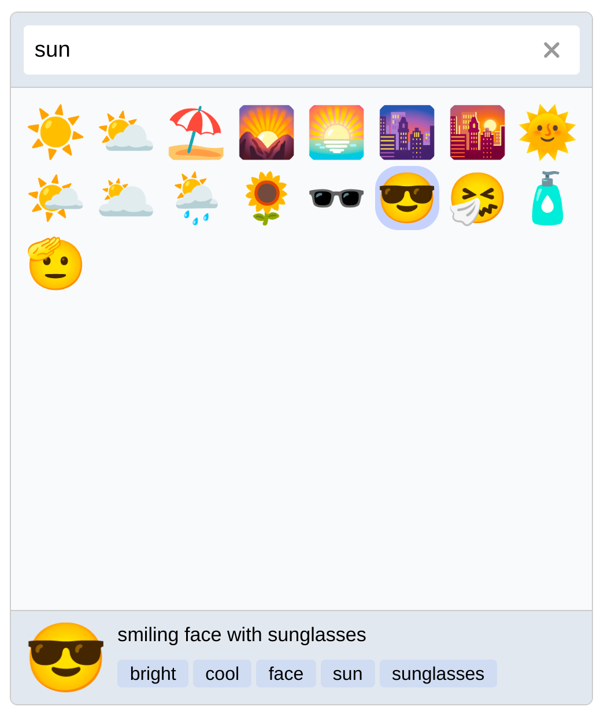

#  PicMo Chrome

This is a Chrome extension to quickly search and copy emoji using the excellent [PicMo][picmo] tool.

*This is project is not affiliated with PicMo, I'm just a big fan.*



## ✔️ Features

- 🔍 Emoji search
- 📜 Recently used emoji
- ⌨️ Completely keyboard accessible
  - Open the picker with `Ctrl+Period`
  - Navigate with Tab and arrow keys
- 🐦 Choose between native and Twitter style emoji

## 💾 Installation Methods

1. [Download from the Chrome Web Store.](https://chrome.google.com/webstore/detail/emoji-button-chrome/ehmacpiolcofcljbiogbjbojdeiiekdi)
2. Download the latest version from [releases](https://github.com/mtimkovich/picmo-chrome/releases).
3. Build from source:

```sh
$ git clone https://github.com/mtimkovich/picmo-chrome
$ npm install
$ npm run build
```

## 🙏 Acknowledgements

* [PicMo][picmo] for doing all the hard work
* [Extension CLI](https://oss.mobilefirst.me/extension-cli/)

## 🤠 Author

Max Timkovich

[picmo]: https://picmojs.com/
